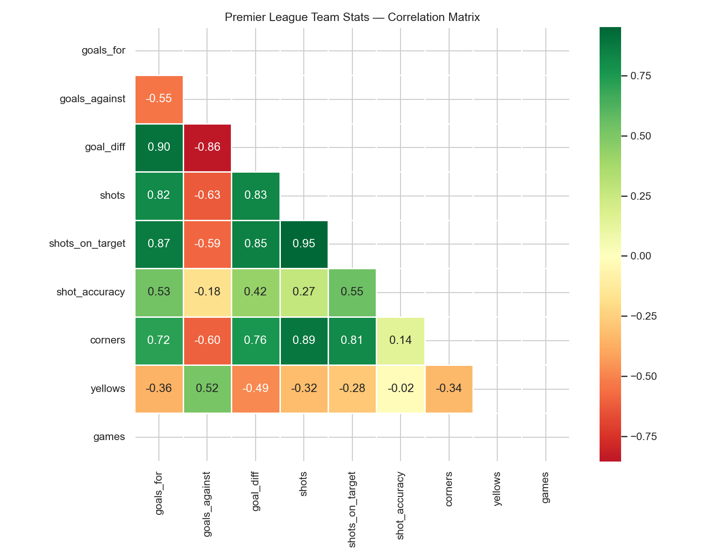

# premier-league-analytics

Jupyter notebooks that analyse the 2022-23 and 2023-24 Premier League seasons: team stats, correlations and significance tests, plus per-90 player radar charts and a player similarity search.

## Run

```bash
pip install -r requirements.txt
python data/fetch_data.py   # two match CSVs from football-data.co.uk, no account needed
jupyter lab                 # run notebooks/01, 02, 03 in order
```

Notebook 01 writes `outputs/team_season_stats.parquet`, which notebook 02 reads. The player notebook uses a small built-in per-90 sample of 2023-24 players, since football-data.co.uk has no player stats. The committed notebooks already contain their outputs.



## Player similarity

```python
from src.similarity import find_similar_players
find_similar_players(player_stats, "Erling Haaland", n=5, metric="cosine")  # or metric="euclidean"
```

## Tests

```bash
pytest
```

Code is MIT licensed. Match data is from football-data.co.uk (free for non-commercial use).
